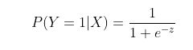
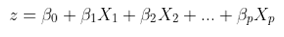
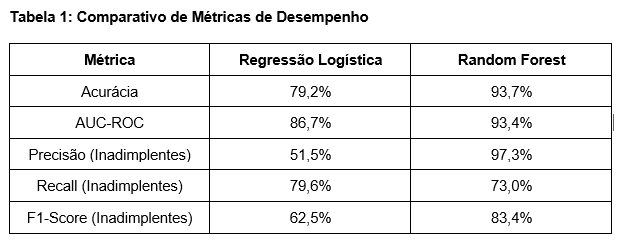
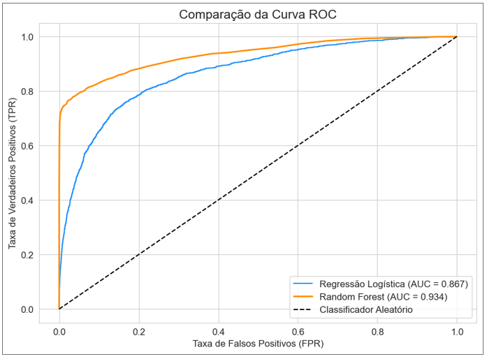
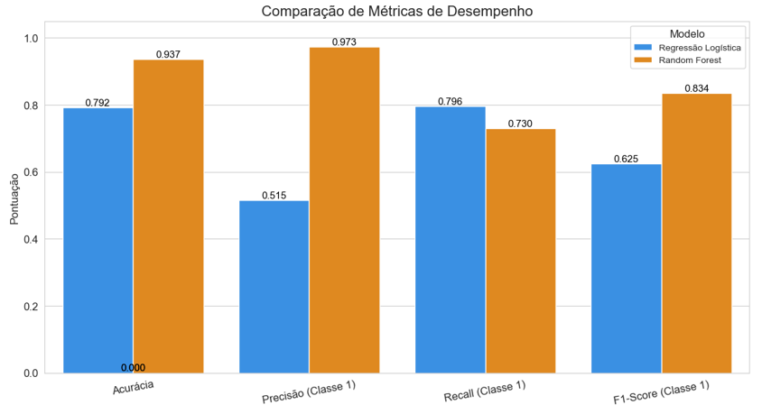
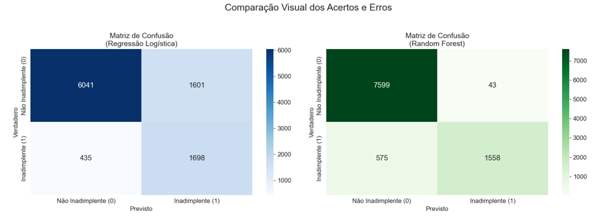
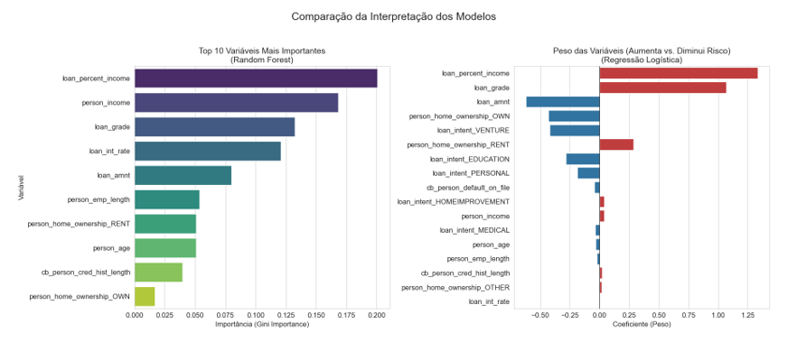

# 3.3. Modelos de Machine Learning Utilizados

## 3.3.1. Regressão Logística

A Regressão Logística é um modelo linear que, apesar do nome, é utilizado para classificação. Ele modela a probabilidade de uma determinada classe (no caso, inadimplência) ocorrer. O modelo calcula uma soma ponderada das variáveis de entrada e aplica a função logística (ou sigmoide) para transformar esse valor em uma probabilidade entre 0 e 1.

Onde z é a combinação linear das variáveis e seus respectivos pesos (coeficientes):

Os coeficientes (β) são aprendidos durante o treinamento e indicam o impacto positivo ou negativo de cada variável na probabilidade de inadimplência.

---

## 3.3.2. Random Forest

O Random Forest é um modelo de ensemble baseado em árvores de decisão. Ele opera construindo uma multitude de árvores de decisão durante o treinamento e gerando a classe que é a moda das classes (classificação) ou a média da previsão (regressão) das árvores individuais. Sua robustez vem de duas fontes principais de aleatoriedade:

- **Bootstrap Aggregating (Bagging):** Cada árvore é treinada em uma amostra aleatória com reposição do conjunto de dados original.  
- **Seleção Aleatória de Atributos:** Em cada nó da árvore, apenas um subconjunto aleatório de variáveis é considerado para a divisão, garantindo a diversidade entre as árvores.

A previsão final para um novo dado é obtida através de uma votação majoritária entre todas as árvores da floresta. A importância de cada variável é medida pela sua capacidade média de reduzir a impureza (Gini Impurity) nos nós das árvores.

---

## 3.4. Métricas de Avaliação

Para avaliar e comparar os modelos, foram utilizadas as seguintes métricas, derivadas da Matriz de Confusão:

- **Acurácia:** Percentual de previsões corretas no geral.  
- **Precisão (Precision):** Dos que foram previstos como inadimplentes, quantos realmente eram. Mede a confiabilidade das previsões positivas.  
- **Recall (Sensibilidade):** Dos que realmente eram inadimplentes, quantos o modelo conseguiu identificar. Mede a capacidade do modelo de encontrar todos os positivos.  
- **F1-Score:** Média harmônica entre Precisão e Recall, um equilíbrio entre as duas.  
- **AUC-ROC:** A Área Sob a Curva ROC, que mede a capacidade geral do modelo de distinguir entre as classes positiva e negativa.

---

# 4. Resultados e Discussão

Após o treinamento e teste dos modelos em um conjunto de dados separado, os resultados foram compilados e analisados tanto quantitativamente, por meio de métricas, quanto qualitativamente, por meio de visualizações gráficas.

---

## 4.1. Desempenho Geral dos Modelos

O desempenho quantitativo dos modelos é resumido na Tabela 1.

A **Figura 1** mostra a **Curva ROC** plotada para visualizar a capacidade de discriminação geral de cada modelo.  
A área sob a curva (AUC) confirma a superioridade do Random Forest.

A **Figura 2** ilustra a comparação direta das métricas de Acurácia, Precisão, Recall e F1-Score, evidenciando o trade-off entre Precisão e Recall.

A análise dos erros é aprofundada na **Figura 3**, que apresenta as matrizes de confusão de forma visual. É notável a drástica redução de Falsos Positivos (de 1601 para 43) no modelo Random Forest, ao custo de um pequeno aumento nos Falsos Negativos (de 435 para 575).

---

## 4.2. Análise de Importância das Variáveis

Para entender os critérios de decisão de cada modelo, foi realizada uma análise da importância das variáveis (**Figura 4**).  
Ambos os modelos concordam que `loan_percent_income` e `loan_grade` são os fatores mais críticos.  
O gráfico da Regressão Logística detalha quais fatores aumentam (coeficiente positivo) ou diminuem (coeficiente negativo) o risco, enquanto o Random Forest ranqueia as variáveis por seu poder preditivo geral.

